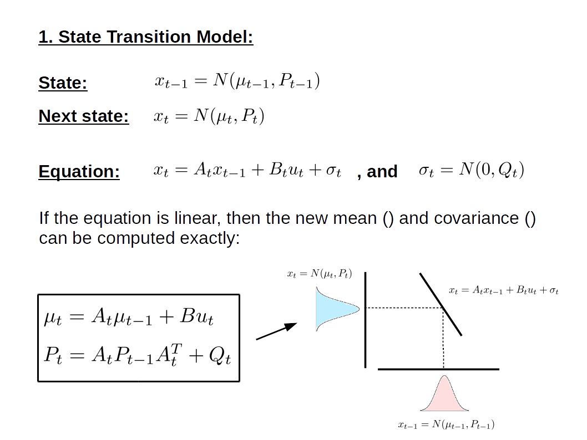
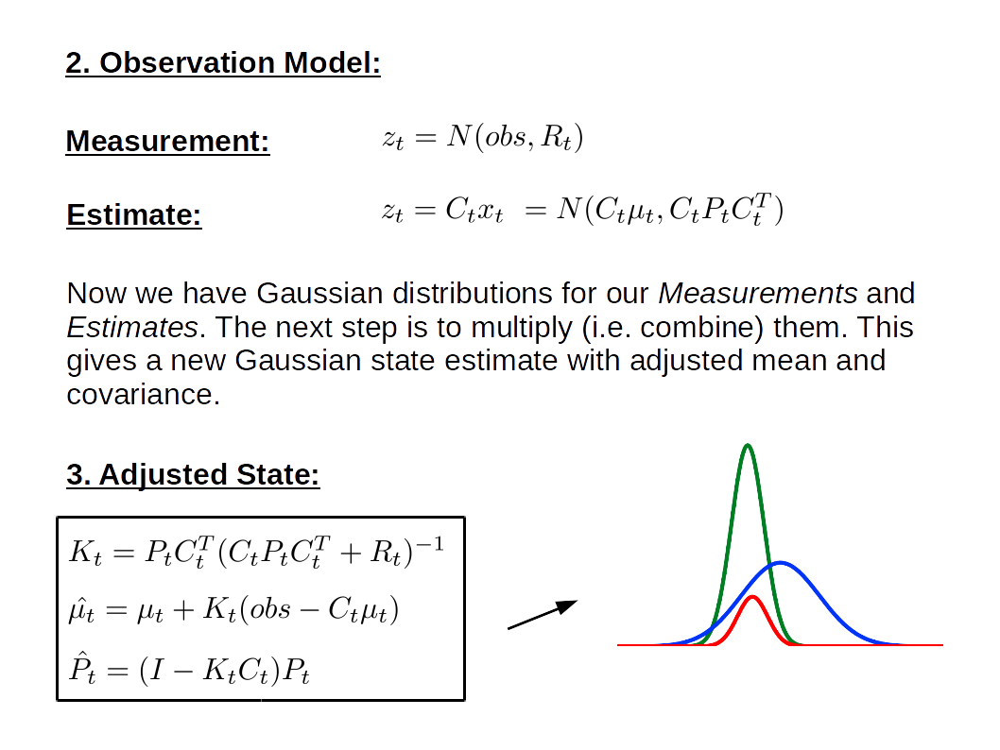
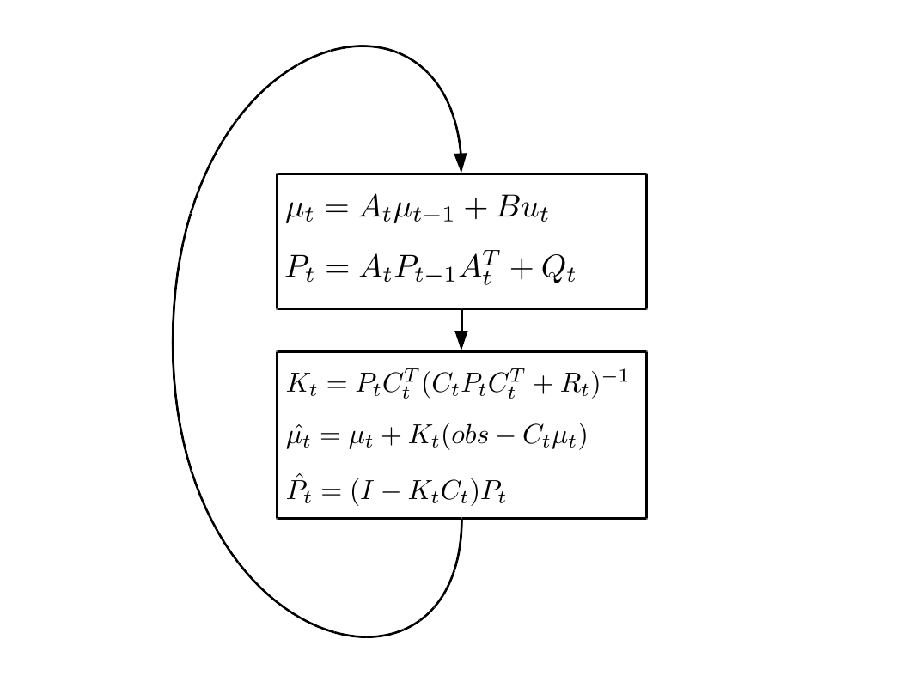

# EKF Background

This document provides additional notes and slides on the Kalman Filter and Extended Kalman Filter. Much of the theory was taken from this [online course](http://ais.informatik.uni-freiburg.de/teaching/ws13/mapping/), but the notation has been adjusted to be consistent with our designs.

## Inroduction:

The Kalman Filter (KF) and Extended Kalman Filter (EKF) are recursive state estimators for linear and non-linear systems with additive white noise. Kalman Filters are popular in edge applications because their computation involve only matrix arithmetic which is efficient to implement on most modern processors. KF's are also optimal estimators. This is because linear functions of Gaussian variables are themselves Gaussian which means that probability distribution functions (pdf's) can be computed exactly, without relying on approximations (eg. sampling, linearisation). On the otherhand, Extended Kalman Filters deal with systems which are non-linear and are thus much better suited to many real-world applications. They assume Gaussian pdf's by linearising a non-linear function about an estimate of the input's mean and covariance. This maintains much of the computational benefits of the Kalman Filter, but introduces an extra computational step involving partial derviatives and Jacobian matrices.

## Where to Start?

Kalman Filters require a reasonably accurate dynamical model for the system in question. As such, a set of states and input variables need to be defined which can characterise the system, where the states are the variables to be estimated. For example, if we are trying to estimate the position of a moving vehicle, position ($p$) and velocity ($\dot{p}$) could be our states while the wind resistance ($\sigma$), road traction ($\eta$) and mass ($m$) of the vehicle could be treated as inputs. This is an example of the system's process model.

    1. Process Equation (State Transition):
$$x_{t} = f(p_{t-1}, \dot{p}_{t-1}, \theta, \eta, m) + \sigma$$
    
In the above equation $x_{t}=[p_{t}, \dot{p}_{t}]$ and $\sigma = N(0, Q)$, where $Q$ refers to the process noise covariance. This is an important parameter which is used to control the uncertainty in our state estimates. This defines the estimation model, but how do we know whether it is accurate or not? and how can we perform updates to reflect changes in the environment? To answer these questions, we use another model which takes noisy measurements (z) from the environment and relates them to the estimated state (x). This is known as the observation model. Updates are then performed by combining both models, trading off the uncertainties for each. 

    2. Observation Equation:

$$z_{t} = h(x_{t}) + \delta$$

In the above equation $\delta = N(0, R)$, where $R$ refers to the observation noise covariance.    


## Variable Definitions:

We have already introduced most of the variables used in Kalman Filters. Here, we provide a reference to their definitions and use cases. 

| Variable | Definition |
|--------|-------|
| $x_{t}$ | estimated state, which is Gaussian distributed according to $N(\mu_{t}, P_{t})$ |
| $\mu_{t}$ | state mean |  
| $P_{t}$ | state covariance |
| f | process model (or state transition function), which is Gaussian distributed according to $N(h(x_{t}, Q)$ |
| h | observation model, which is Gaussian distributed according to $N(h(x_{t}, R)$ |
| Q | process noise covariance matrix |
| R | observation noise covariance matrix |
| $z_{t}$ | measurements, which are Gaussian distributed accoriding to $N(h(x_{t}), R)$ |
| F | process Jacobian matrix (used only in EKF) |
| H | observation Jacobian matrix (used only in EKF) |
| K | Kalman gain, which refers to the relative weight given to estimates over measurements. |
        
Next we use the above definitions to explain and contrast the Kalman Filter (KF) and Extended Kalman Filter (EKF).         


## Kalman Filter:







## Extended Kalman Filter:


```python

```
