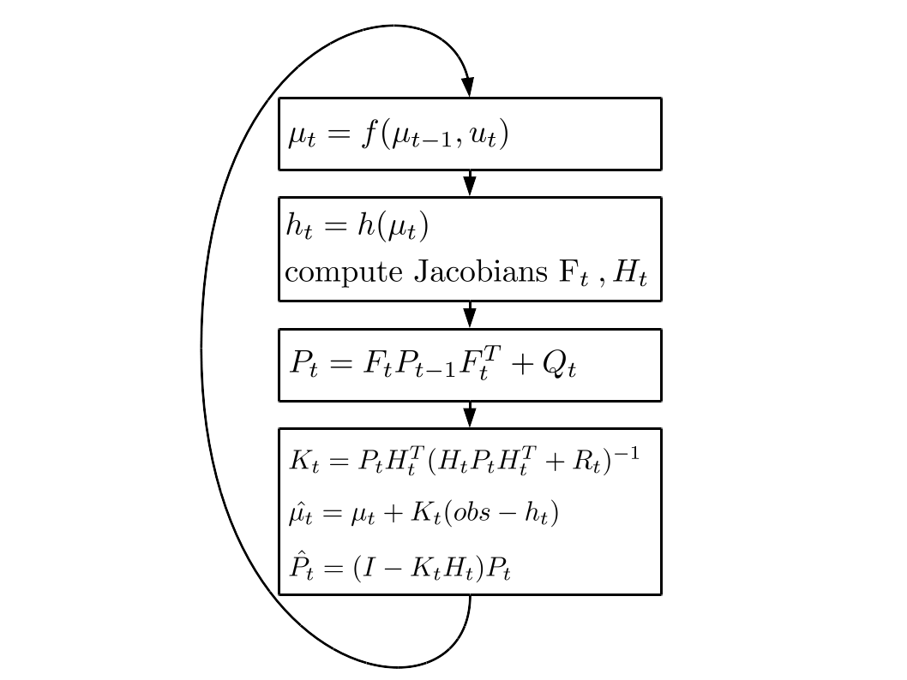

# PYNQ Extended Kalman Filter (EKF) 

This repository provides an example of PYNQ supporting multiple boards from a single pip-installable package. From the same HLS/SDSoC source code, and using the same Python API and notebooks, we can develop applications which simply move across Xilinx boards. This has the potential to simplify the deployment of code in embedded applications, improve reusability and reduce design time.  

## Quick Start:

Open a terminal on your PYNQ board and run:

```
sudo pip3.6 install git+https://github.com/sfox14/pynq-ekf.git 
```

This will install the "pynq-ekf" package to your board, and will create the "ekf" directory in the PYNQ_JUPYTER_NOTEBOOKS path. Here, you will find notebooks which test our EKF design.

1. [gps_example.ipynb](./notebooks/gps_example.ipynb) - the application of EKF in gps
2. [light_example.ipynb](./notebooks/light_example.ipynb) - a sensor fusion example using KF and the PYNQ board's I/O

## Background:

The Kalman Filter (KF) and Extended Kalman Filter (EKF) are recursive state estimators for linear and non-linear systems with additive white noise. Kalman Filters are popular in edge applications because their computation involves only matrix arithmetic which is efficient to implement on most modern processors. KF's are also optimal estimators. This is because linear functions of Gaussian variables are themselves Gaussian meaning that probability distribution functions (pdf's) can be computed exactly, without relying on approximations such as sampling. On the otherhand, Extended Kalman Filters deal with systems which are non-linear and are thus much better suited to many real-world applications. They assume Gaussian pdf's by linearising a non-linear function about an estimate of the input's mean and covariance. This maintains much of the computational benefits of the Kalman Filter, but introduces an extra computational step involving partial derviatives and Jacobian matrices. 



A more detailed introduction to Kalman Filtering is given [here](./BACKGROUND.md) including some slides and links.

## Design and Implementation:

The amount and type of computation for both KF and EKF can vary a lot between applications. For this reason, we have a choice of two architectures:

1.) Hardware-Software (HW-SW): This design offers flexibility and generality because only the application-independent part of the algorithm is accelerated on the FPGA. The application specific code can be written in software.

2.) Hardware-Only (HW): This design can offer higher performance by deploying the entire algorithm on the FPGA. 

The size of both architectures are determined by two parameters: 1.) the number of states ($N$), and 2.) the number of observations ($M$). This repository contains bitstreams and libraries for both architectures, and includes an automatic build flow for rebuilding different $N$ and $M$ configurations. For the hardware-only design, you need to add your own HLS if you want to rebuild for new applications. Fixed point numbers, with bitwidth=32 and fracwidth=20, are used in both designs.

### Hardware-Software (HW-SW):

The figure below shows how the computation is separated between PS and PL. The variables used here are explained in the [background](./BACKGROUND.md) and are consistent with our Python and HLS code. This design offers runtime flexibility and can be generalised for KF and EKF problems. The state (x) as well as the state (P), process (Q) and observation (R) covariance matrices can be loaded at runtime. Furthermore, the state transition function (f(x)) and observation model (h(x)) are computed in software. This allows compatability with more complex systems.


The PL is a dataflow of matrix operations. The figure below gives an illustration of the type and sequence of computation that is performed. The primary computational bottleneck is the matrix inversion. We implemented this via LU Decomposition and this [app note](https://www.xilinx.com/support/documentation/application_notes/xapp1317-scalable-matrix-inverse-hls.pdf).   


This design requires a relatively large amount of data from external memory each iteration. On small problems, this approach gives bad performance since the majority of time is spent transferring data between processor and FPGA. Furthermore, converting between Fixed and Floating point number representations is expensive and further reduces system throughput/performance.

### Hardware (HW):

Given the performance drawbacks of the HW-SW co-design, it may be better to implement the entire algorithm on the FPGA. The [gps_example.ipynb](./notebooks/gps_example.ipynb) notebook gives an example for this.


## Build Flow:

Our build flow is documented [here](./build/BUILD.md)

## Known Issues:

1. The HW-SW HLS/SDSoC design using ACP cache coherent ports is not working.


## References:

[Kalman Filter Notes and Slides](http://ais.informatik.uni-freiburg.de/teaching/ws13/mapping/) - Online lectures and notes given on EKF by Cyril Stachniss (Albert-Ludwigs-Universität Freiburg).
[TinyEKF](https://github.com/simondlevy/TinyEKF/) - An example C/C++ and Python implementation of EKF for Arduino. This repository also contains working C code for the gps example.  

