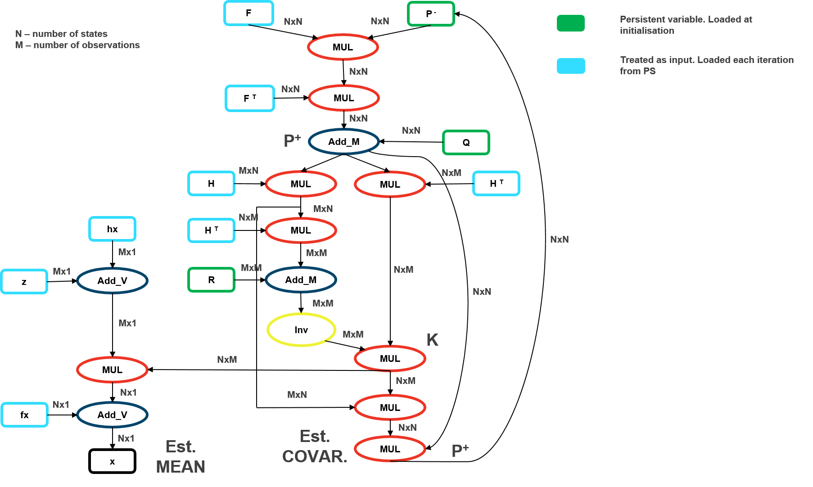
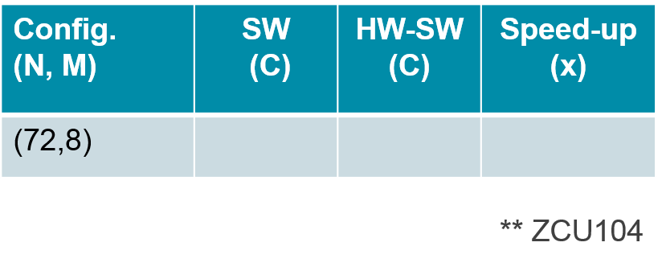

# PYNQ Extended Kalman Filter (EKF) 

This repository provides an example of PYNQ supporting multiple boards from a single pip-installable package. From the same HLS/SDSoC source code, and using the same Python API and notebooks, we can develop applications which simply move across Xilinx boards. This has the potential to simplify the deployment of code in embedded applications, improve reusability and reduce design time.  

## 1.  Quick Start:

-------------------------------------------------------------------------------------------------------------------------

Open a terminal on your PYNQ board and run:

```
sudo pip3 install --upgrade git+https://github.com/sfox14/pynq-ekf.git 
```

This will install the "pynq-ekf" package to your board, and will create the "ekf" directory in the PYNQ_JUPYTER_NOTEBOOKS path. Here you will find notebooks which test our EKF design.

1. [gps_notebook.ipynb](./notebooks/gps_notebook.ipynb) - the application of EKF in gps
2. [light_notebook.ipynb](./notebooks/light_notebook.ipynb) - a sensor fusion example using KF and board I/O


## 2. Background:

-------------------------------------------------------------------------------------------------------------------------

The Kalman Filter (KF) and Extended Kalman Filter (EKF) are recursive state estimators for linear and non-linear systems respectively, with additive white noise. KFs are optimal estimators whereas EKFs have to make an approximation. This is because linear functions of Gaussian variables are themselves Gaussian, and hence the posterior probability distribution function (PDF) can be computed exactly, applying matrix operators without doing any sampling. This also has computational benefits since the majority of modern processors are good at handling matrices. To leverage the benefits of linear models, for non-linear signals, EKFs find an approximation by linearising around an estimate of the non-linear function's mean. Linearisation is the same as computing the gradient, which means that matrices of partial derivatives (i.e. Jacobian matrices) need to be computed for each iteration or state estimate. Kalman Filtering is a prediction technique for modelling uncertainty, and therefore every variable and function has an associated mean and covariance which is assumed Gaussian. KFs and EKFs work by combining two noisy models, a process or state transition function (f) and observation function (h), and trade off the uncertainties of each to form a better estimate of the underlying state. This is captured in the computational graph for the EKF below:

<p align="center">

</p>

For more information on Kalman Filters, [this course](http://ais.informatik.uni-freiburg.de/teaching/ws13/mapping/) provides good explanation and notes .


## 3. Design and Implementation:

-------------------------------------------------------------------------------------------------------------------------

There are two accelerator architectures.

* Hardware-Software (HW-SW): This design offers flexibility and generality because only the application-independent part of the algorithm is accelerated on the FPGA. The application specific code can be written in software.

* Hardware-Only (HW): This design can offer higher performance by deploying the entire algorithm on the FPGA. 

The size of both architectures is largely determined by two parameters: 

* **N** - the number of states 
* **M** - the number of observations

This repository contains bitstreams and libraries for both architectures, and includes a build flow for rebuilding different (N,M) configurations for the hybrid HW-SW architecture only. In `boards\$(BOARD_NAME)\hw-sw`, you will see bitstream (and accompanying tcl) files named with an `n${N}m${M}` suffix to indicate it's configuration. Models/Applications which have the same configuration, can share the same bitstream. 

#### Hardware-Software (HW-SW):

The figure below shows how the computation is separated between Processing System (PS) and Programmable Logic (PL). This design offers runtime flexibility and can be generalised for KF and EKF problems. The state (x) as well as the state covariance (P), process covariance (Q) and observation covariance (R) matrices can be loaded at runtime. Furthermore, the state transition function, f(x), and observation model, h(x), are computed in software on the ARM processor. This allows compatability with more complex systems.

<p align="center">

</p>

The PL implements the required matrix operations in a dataflow architecture. The figure below gives an illustration of the type and sequence of computation that is performed. The primary computational bottleneck is the matrix inversion. We implemented this via LU Decomposition ([app note](https://www.xilinx.com/support/documentation/application_notes/xapp1317-scalable-matrix-inverse-hls.pdf)). This design requires a relatively large amount of data from external memory each iteration. On small problems, this approach gives bad performance since the majority of time is spent transferring data between processor and FPGA. Furthermore, converting between Fixed and Floating point number representations is expensive and further reduces system throughput/performance.   

<p align="center">

</p>

#### Hardware (HW):

Given the performance drawbacks of the HW-SW co-design, it may be better to implement the entire algorithm on the FPGA. The [gps_example.ipynb](./notebooks/gps_notebook.ipynb) notebook gives an example for this, however this option can not support other EKF applications or configurations.


## 4. Performance:
-------------------------------------------------------------------------------------------------------------------------

Table 1 shows performance of the EKF accelerator on the GPS example. It assumes a model with **N=8** states and **M=4** observations, and is the same as the C/C++ model implemented [here](https://github.com/simondlevy/TinyEKF/). The dataset is generated in [make_dataset.py](./utils/python/make_dataset.py), and characterises a typical GPS system. The execution time of the accelerator was measured from callsites written in both Python and C, for SW-only, HW-only and hybrid HW-SW designs, and shows up to **45x speed-up** when the entire algorithm is deployed on the FPGA.                                                                                                                                          
<p align="center">

</p>

The design can be scaled to support bigger problems and larger devices. Table 2, shows an EKF with N=72 and M=8 running on Zynq-Ultrascale+

<p align="center">

</p>

## 5. Build Flow:
-------------------------------------------------------------------------------------------------------------------------

Follow the instructions [here](./build.md) to rebuild the EKF. This repository contains prebuilt bitstreams and libraries for SDSoC projects built against Pynq-Z1, Ultra96 and ZCU104 boards. You must have a valid Xilinx license for Vivado and SDSoC 2017.4 to run the makefile.

Example:
```shell
make PLATFORM=<eg. /home/usr/platform/Pynq-Z1> BOARD=<eg. Pynq-Z1, Ultra96> CLK_ID=<eg. 0, 1> 
```

## 6. Repository Structure:
-------------------------------------------------------------------------------------------------------------------------
* `boards: ` List of boards currently supported, with their associated bitstreams and libraries.
   * `Pynq-Z1/Ultra96/ZCU104: ` Supported boards
      * `hw: ` Contains .bit .tcl and .so files for hardware-only designs
      * `hw-sw: ` Contains .bit .tcl and .so files for hybrid hardware-software architecture
* `build: ` The source and scripts for the multi-board build flow
    * `arm: ` Makefile for linking SDSoC output object files on the board. This script is called from `setup.py` during pip install.
    * `x86: ` Host machine makefile
      * `src: ` HLS/SDSoC source files
         * `hw: ` Hardware-only architecture (eg. gps example)
         * `hw-sw: ` Hybrid HW-SW architecture (eg. n8m4, n2m2, n72m8)
      * `dist: ` Contains the compiled SDSoC object files from `make`
* `ekf: ` Python source and API. Each design inherits from a base class and implements their own model.
    * `__init__.py: ` contains the EKF base class
    * `gps_ekf.py: ` python class for the GPS example
    * `light_ekf.py: ` python class for the Light sensor-fusion example
* `utils: ` Extra repository stuff
    * `imgs: ` Pictures, illustrations and tables
    * `python: ` Code for generating `gps_data.csv` and `params.dat`
    * `tiny-ekf: ` An adapted version of TinyEKF for our generated GPS dataset. Used to benchmark performance.
* `notebooks: `: Two jupyter notebooks that call the EKF hw-accelerators.


## 7. Known Issues:
-------------------------------------------------------------------------------------------------------------------------

* There is a memory issue with the HW-SW design's Python wrapper. To get correct outputs, the OS cache needs to be flushed each iteration. The cause of this problem is still unknown. 


## 8. References:
-------------------------------------------------------------------------------------------------------------------------

* [Kalman Filter Notes and Slides](http://ais.informatik.uni-freiburg.de/teaching/ws13/mapping/) - Online lectures and notes given on EKF by Cyril Stachniss (Albert-Ludwigs-Universität Freiburg).

* [TinyEKF](https://github.com/simondlevy/TinyEKF/) - An example C/C++ and Python implementation of EKF for Arduino. This repository also contains working C code for the gps example. 

## 9. Licenses

**PYNQ** License : [BSD 3-Clause License](https://github.com/Xilinx/PYNQ/blob/master/LICENSE)

**TinyEKF** License : [MIT License](https://github.com/simondlevy/TinyEKF/blob/master/LICENSE.md)

